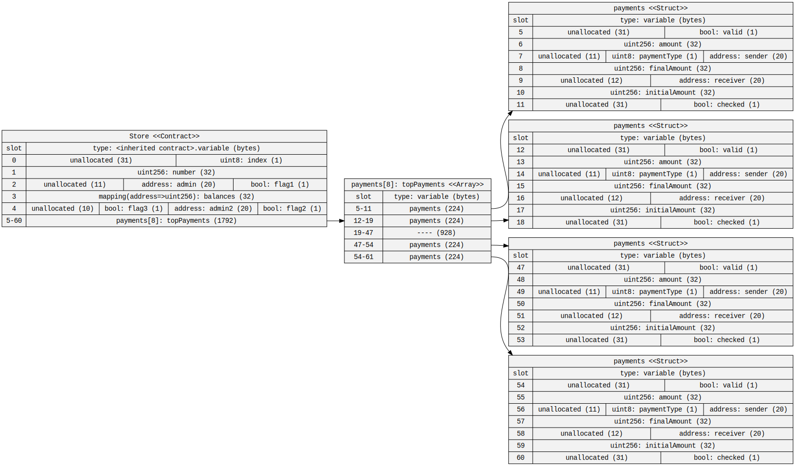

https://gist.github.com/extropyCoder/6e9b5d5497b8ead54590e72382cdca24  

## Q1. Use the sol2uml tool to find out how many storage slots it is using in the above contract. By re ordering the variables, can you reduce the number of storage slots needed?

A. 
> Yes, by reordering the variables as shown in the below program, the number of slots used can be reduced from initial 60 to 43.

```
contract Store {
    struct payments {
        uint256 amount;
        uint256 initialAmount;
        uint256 finalAmount;
        address sender;
        bool valid;
        uint8 paymentType;
        bool checked;
        address receiver;
    }
    uint256 public number;
    uint8 index;
    address admin;
    bool flag1;
    bool flag2;
    bool flag3;
    address admin2;
    mapping (address=>uint256) balances;
    payments[8] topPayments;

    constructor(){}

    function setNumber(uint256 newNumber) public {
        number = newNumber;
    }

    function increment() public {
        number++;
    }
}
```

<br>
Storage slots used initially: 



<br>

Storage slots used after reordering the variables:


<br>

